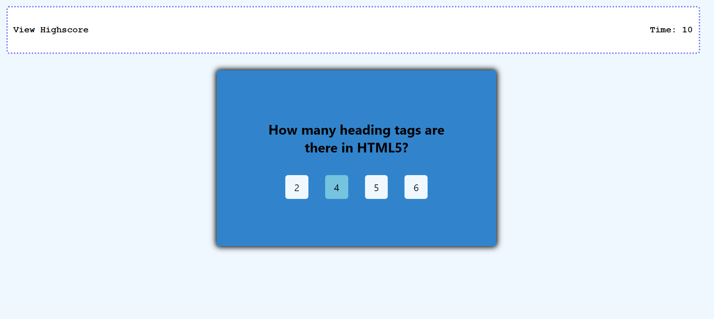
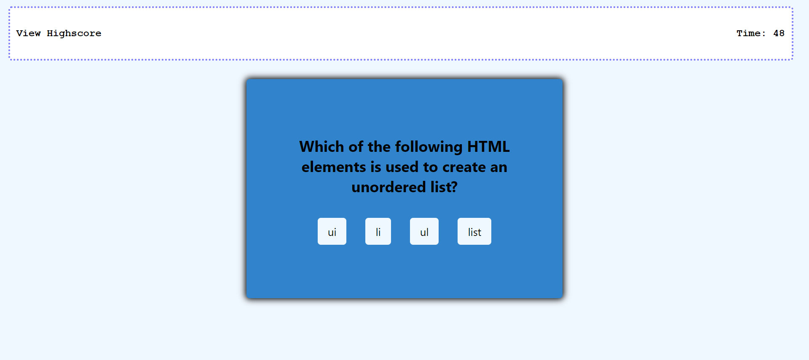

# Homework-Week-4
Screenshots:

Description:

First I started off my coding quiz by creating my HTML document and linking my CSS file in the head. I have a semantic nav tag which holds the navbar content like the "View Highscore" link and the timer. The semantic main tag holds the quiz body where the questions and answers will appear. I then linked the JavaScript file in the bottom of the body tag.

I then began to give some effects to my page and navbar within the CSS file with different colors and fonts. I started my JavaScript off with the object of my questions and the choices the user would be given. I declared all of my variables so the score would start at 0 and the timeLeft at 0. I ran a function that started the quiz with a certain amount of time and if the user ran out of time, the game would be over. If the user gets the question wrong, the time is deducted by 15 seconds, but if they get it right, 20 points is added to their overall score. The user is able to store their highscore along with their initials to local storage.

Link to Deployed Application:

https://todtsies.github.io/Homework-Week-4/